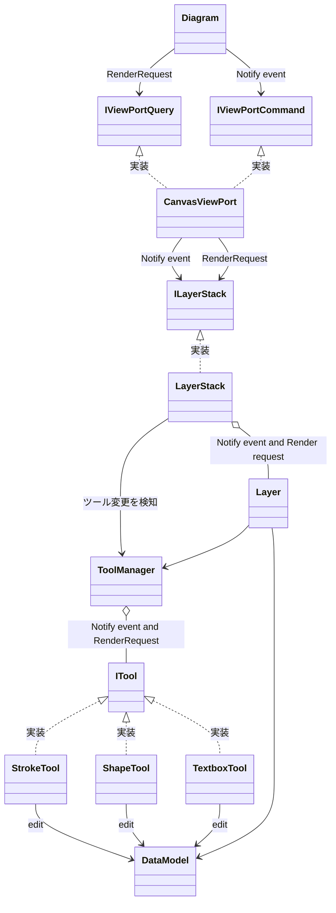

```mermaid
classDiagram

Diagram --> IViewPortQuery : RenderRequest
Diagram --> IViewPortCommand : Notify event
IViewPortQuery <|.. CanvasViewPort : 実装
IViewPortCommand <|.. CanvasViewPort : 実装
CanvasViewPort --> ILayerStack : Notify event
CanvasViewPort --> ILayerStack : RenderRequest
ILayerStack <|.. LayerStack : 実装
LayerStack --> ToolManager : ツール変更を検知
LayerStack o-- Layer : Notify event and Render request
Layer --> ToolManager
ToolManager o-- ITool : Notify event and RenderRequest
Layer --> DataModel
ITool <|.. StrokeTool : 実装
StrokeTool --> DataModel : edit
ITool <|.. ShapeTool : 実装
ShapeTool --> DataModel : edit
ITool <|.. TextboxTool : 実装
TextboxTool --> DataModel : edit
```