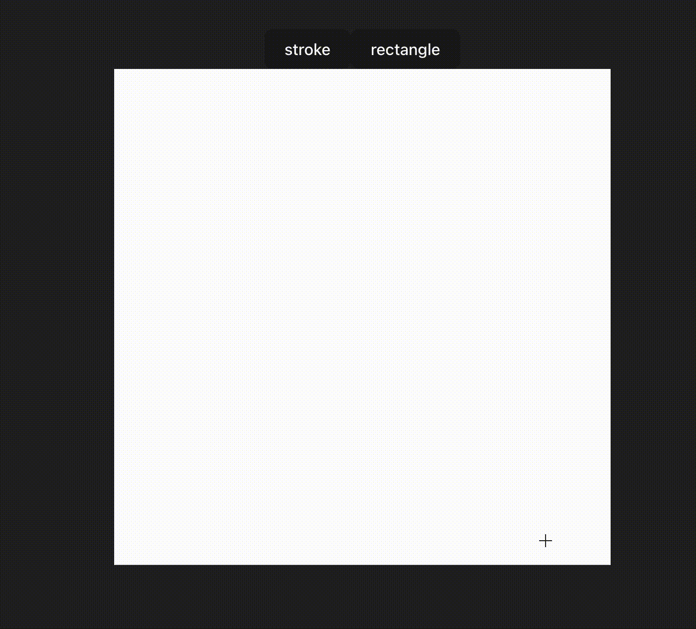

# canvas-diagrams

canvas上で手書きと図形作成を同時達成できないかと試行錯誤するリポジトリ

ついでにパッケージ化も試してみている

## sandbox

お試しで動作させる（デバッグ含む）ためには以下

```sh
yarn
yarn build:esm

cd ./sandbox/vite-project
yarn dev

# chrome等で開く
```


